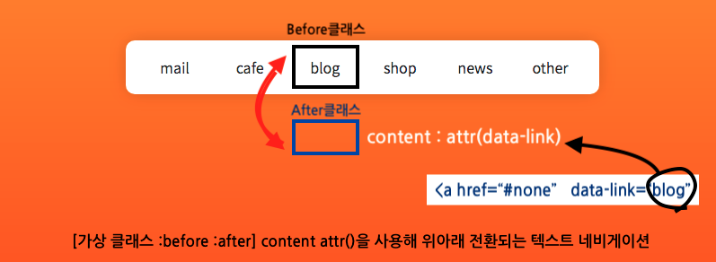
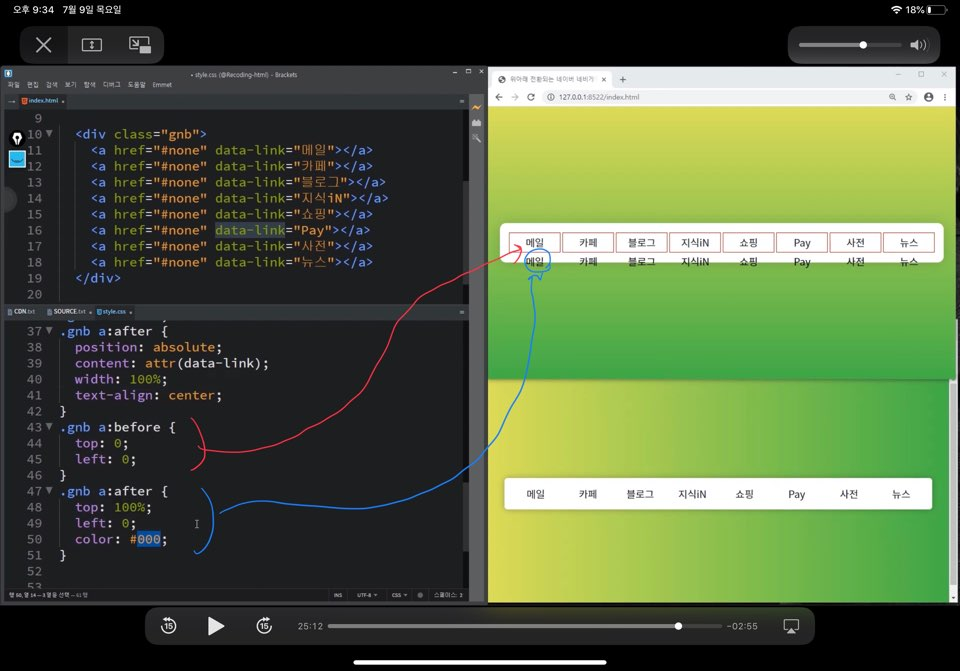

# hover시 text가 invert하는 애니메이션

## 1. preview

### before, after, data-link 사용
#### 가상클래스 before, after의 활용


## 2. 코드 분석

### 1) html

#### (1) 사용자 정의 속성 사용
- `data-link` : `a`태그에 사용자 정의 속성을 사용해 메뉴명을 지정 

```html
<body>
    <div class="gnb"> 
        <!-- 사용자정의속성(data-뭐시기) data-link = "값" -->
        <a href="#none" data-link = "mail"></a>
        <a href="#none" data-link = "cafe"></a>
        <a href="#none" data-link = "blog"></a>
        <a href="#none" data-link = "shop"></a>
        <a href="#none" data-link = "news"></a>
        <a href="#none" data-link = "other"></a>
    </div>

</body>

```

<br/><br/>

### 2) css

#### (1) 중앙정렬하기
- `display`, `align-items`, `justify-content`을 사용해 `body`내부 요소 중앙정렬하기

```css
body{
    font-family: 'Noto Sans KR', sans-serif;
    height: 100vh;
    display: flex;
    align-items: center;
    justify-content: center;
    background: linear-gradient(orange, orangered);   
}
a {
    text-decoration: none;
    color: #222;
  }

.gnb{
    background-color: #fff;
    padding: 15px;
    border-radius: 10px;
    box-shadow: 0 0 20px rgba(0, 0, 0, 0.164);
    padding-bottom: 10px;
}

```

<br/>

#### (2) a태그의 가상클래스 생성하기
- 먼저, `a`태그의 display를 변경하여 a태그를 블록화시킴
- `a`태그의 가상자식클래스인 `before`, `after`가 넘치면 `overflow:hidden`으로 숨김
- `attr`을 사용하여 `html`의 속성에 접근하고, `before`, `after`의 값을 설정함


```css
.gnb a{
    width: 80px;  
    display: inline-block;   /*inline-block을 하면 a태그와 같은 inline들의 크기 설정이 가능(a태그의 블록화)*/
    height: 30px;
    line-height: 30px;        /*글자의 세로 위치를 조정*/
    text-align: center;
    position: relative;
    overflow: hidden;       /*넘치는 before, after를 숨긴다.*/
}

.gnb a:before,
.gnb a:after{
    position: absolute;  /*부모가 relative이므로, 자식은 절대위치로 화면크기변동에도 같은 위치를 유지할 수 있음*/
    content: attr(data-link);  /*attr을 사용하여 html의 속성을 사용*/
    width: 100%;
}

```


<br/>

#### (3) before, after 애니메이션 설정

- `before`는 `hover`시 위로 올라가 화면 상에 사라짐
- `after`는 `hover`시 위로 올라가 화면 상에서 나타남



  
```css
.gnb a:before{
    top : 0;  /*부모속성위에 겹쳐있게함*/
    left : 0;
    transition: 0.3s;
  
}
/* before는 hover시 위로 올라감 */
.gnb a:hover:before{
    top : -100%;
}


.gnb a:after{
    top : 100%;
    left : 0;
    color : #ff8c5f;
    transition: 0.3s;
}


.gnb a:hover:after{
    top : 0;
}
    
```

